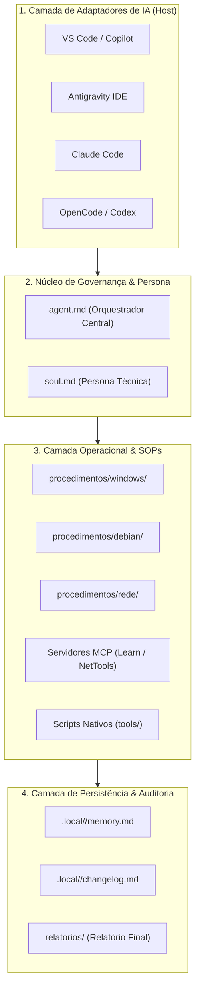

# Arquitetura do Brazilian Computer Guy (BCG)

Este documento detalha o modelo arquitetural, o ciclo de vida de um atendimento técnico e as fronteiras de isolamento de dados do **Brazilian Computer Guy**.

---

## 1. Visão Geral da Arquitetura

O BCG foi projetado sobre uma arquitetura desacoplada e modular, composta por 4 camadas essenciais:

---

## 2. Isolamento de Dados e Privacidade

1. **Repositório Template Neutro:**
   - O repositório distribuído no GitHub é totalmente agnóstico e isento de logs, caminhos ou históricos da máquina do desenvolvedor.
2. **Persistência Volátil e Isolada:**
   - Quando um computador é atendido, o agente instancia a pasta `.local/<nome-da-maquina>/`.
   - Essa pasta é ignorada pelo `.gitignore` e pertence exclusivamente à máquina atendida.
3. **Não Exposição de Segredos:**
   - O agente nunca transmite variáveis de ambiente sensíveis (`.env`), senhas ou tokens aos modelos de IA ou consultas documentais.

---

## 3. O Ciclo de Vida do Atendimento Técnico

Todo atendimento executado pelo BCG segue 6 fases bem delimitadas:
1. **Identificação do Ambiente:** Detecção de SO, versão, hostname e leitura da memória local prévia.
2. **Diagnóstico Somente Leitura:** Coleta de evidências usando SOPs e scripts sem alteração de estado.
3. **Proposta Técnica e Hipótese:** Formulação da causa raiz e proposta com comando exato e reversão.
4. **Consentimento Explícito (Opt-in):** Parada obrigatória aguardando aprovação explícita do técnico.
5. **Execução & Validação:** Aplicação do procedimento autorizado e teste antes/depois.
6. **Emissão de Relatório:** Geração do Relatório Técnico de Atendimento oficial para entrega e histórico.
